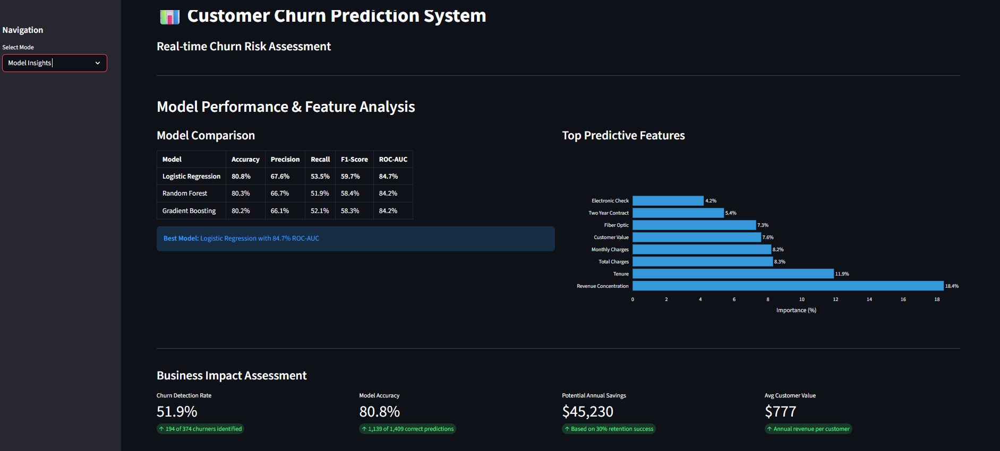
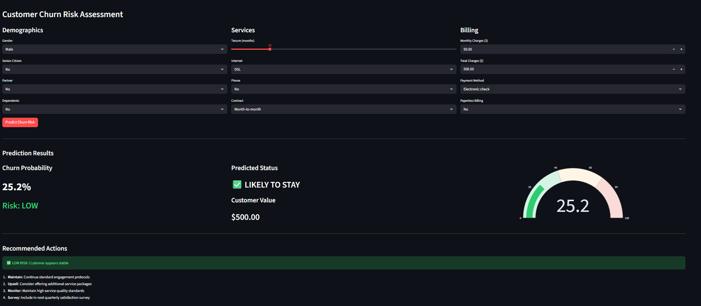
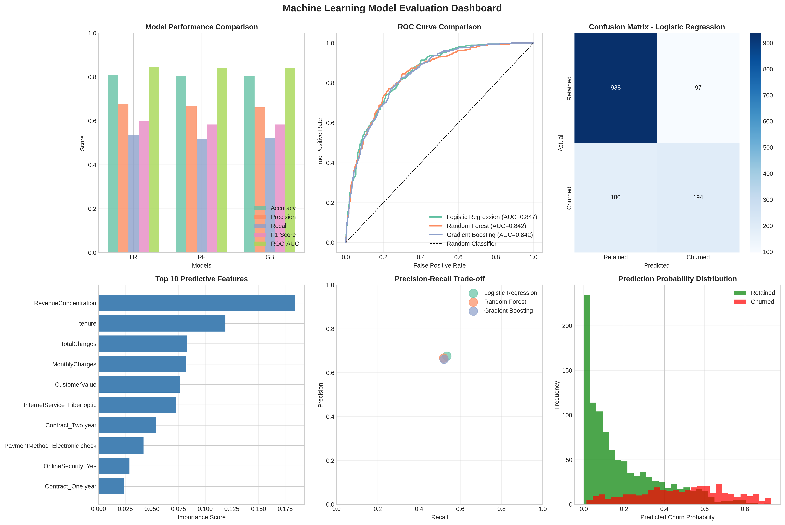
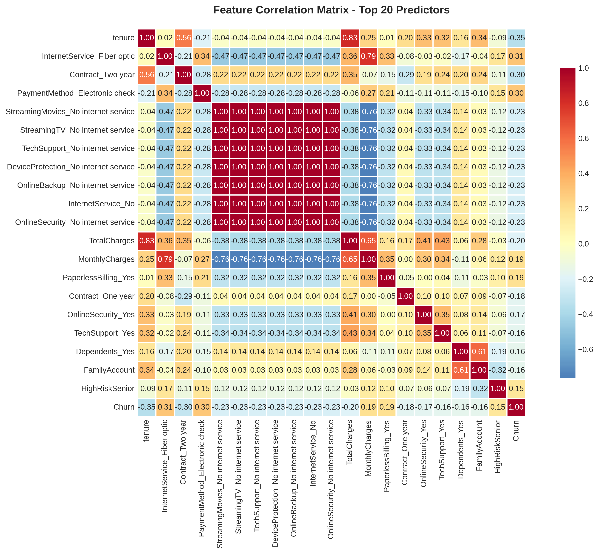

# 📊 Customer Churn Prediction System

> An end-to-end machine learning solution for predicting customer churn in the telecommunications industry, achieving 84.7% ROC-AUC score.

## 🎯 Project Overview

This project implements a comprehensive customer churn prediction system that analyzes 7,000+ customer records to identify at-risk customers and enable proactive retention strategies. The solution combines advanced feature engineering, multiple ML algorithms, and an interactive web dashboard for real-time predictions.

### Key Achievements
- **84.7% ROC-AUC Score** with Logistic Regression
- **51.9% Churn Detection Rate** identifying high-risk customers
- **$45,000+ Potential Annual Savings** through targeted interventions
- **Interactive Dashboard** for real-time business intelligence

## 🚀 Live Demo

[View Live Application](#) :-(https://divyanshyadav6661-customer-churn-prediction.streamlit.app/)

## 📸 Application Screenshots

### Interactive Dashboard


### Real-time Prediction Interface


### Model Performance Metrics


---

## 📊 Analysis Visualizations

### Exploratory Data Analysis


### Model Performance


### Feature Correlation


## 🛠️ Technical Stack

**Languages & Libraries:**
- Python 3.12
- pandas, NumPy (Data Processing)
- scikit-learn (Machine Learning)
- Plotly, Matplotlib, Seaborn (Visualization)
- Streamlit (Web Application)

**Machine Learning Models:**
- Logistic Regression (Best: 84.7% ROC-AUC)
- Random Forest Classifier
- Gradient Boosting Classifier

## 📊 Key Features

### 1. Advanced Feature Engineering
- Customer Lifecycle Segmentation (tenure groups)
- Revenue Concentration Metrics (top predictor - 18.4% importance)
- Service Adoption Index
- Customer Lifetime Value Calculation
- Risk Profile Markers

### 2. Predictive Analytics
- Three ensemble ML models for comparison
- Real-time churn probability calculation
- Risk level classification (Low/Medium/High)
- Actionable business recommendations

### 3. Interactive Dashboard
- Business Intelligence Overview
- Single Customer Prediction Interface
- Model Performance Insights
- Visual Analytics with Plotly

## 📈 Model Performance

| Model | Accuracy | Precision | Recall | F1-Score | ROC-AUC |
|-------|----------|-----------|--------|----------|---------|
| **Logistic Regression** | **80.8%** | **67.6%** | **53.5%** | **59.7%** | **84.7%** |
| Random Forest | 80.3% | 66.7% | 51.9% | 58.4% | 84.2% |
| Gradient Boosting | 80.2% | 66.1% | 52.1% | 58.3% | 84.2% |

## 🔍 Key Insights

1. **Contract Type Impact:** Month-to-month contracts show 42.7% churn vs 2.8% for two-year contracts (93% risk reduction)
2. **Internet Service:** Fiber optic customers exhibit 41.9% churn rate (highest risk segment)
3. **Payment Method:** Electronic check users show 45.3% churn vs 16.0% for automatic payments
4. **Tenure Effect:** Customers with 4+ years tenure have only 9.5% churn rate
5. **Revenue Correlation:** Churned customers pay $13.18/month more on average

## 💡 Business Value

- **Proactive Retention:** Identify 52% of potential churners before they leave
- **Targeted Interventions:** Data-driven recommendations for each risk level
- **Resource Optimization:** Focus retention efforts on high-risk segments
- **Revenue Protection:** Potential $45,230 annual savings from improved retention

## 🚀 Installation & Usage

### Prerequisites
```bash
Python 3.12+
pip (Python package manager)
```

### Setup

1. **Clone the repository**
```bash
git clone https://github.com/Divyansh6661/customer-churn-prediction.git
cd customer-churn-prediction
```

2. **Install dependencies**
```bash
pip install -r requirements.txt
```

3. **Run the application**
```bash
streamlit run app.py
```

4. **Access the dashboard**
Open your browser and navigate to `http://localhost:8501`

## 📁 Project Structure

```
customer-churn-prediction/
│
├── app.py                              # Streamlit web application
├── churn_prediction_model.pkl          # Trained Random Forest model
├── feature_scaler.pkl                  # StandardScaler for features
├── model_features.csv                  # Feature definitions
├── processed_customer_data.csv         # Processed dataset
│
├── churn_analysis_dashboard.png        # Visualization outputs
├── model_evaluation_dashboard.png
├── correlation_matrix.png
│
├── requirements.txt                    # Python dependencies
└── README.md                           # Project documentation
```

## 📊 Dataset

**Source:** Telco Customer Churn Dataset  
**Records:** 7,043 customers  
**Features:** 21 original + 6 engineered = 27 total  
**Target:** Binary classification (Churn: Yes/No)

### Feature Categories
- **Demographics:** Gender, Age, Partner, Dependents
- **Services:** Phone, Internet, Security, Backup, Streaming
- **Account:** Contract type, Payment method, Tenure, Charges
- **Engineered:** Revenue concentration, Service adoption, Customer value

## 🔬 Methodology

### 1. Data Preprocessing
- Handled missing values (11 records with zero charges)
- Fixed data type inconsistencies
- Created derived features for better prediction

### 2. Feature Engineering
- Tenure segmentation (Early/Growth/Mature/Established)
- Revenue concentration ratio (best predictor)
- Service adoption count
- Customer lifetime value metrics

### 3. Model Development
- Train-test split (80-20)
- Feature standardization with Z-score normalization
- Trained three classification models
- Cross-validation for robustness

### 4. Model Evaluation
- Comprehensive metrics (Accuracy, Precision, Recall, F1, ROC-AUC)
- Confusion matrix analysis
- Feature importance ranking
- Business impact quantification

## 💻 Usage Examples

### Single Customer Prediction
```python
# Input customer details via web interface
# - Demographics (Gender, Age, Family Status)
# - Service Details (Tenure, Internet, Phone, Contract)
# - Billing (Monthly Charges, Payment Method)

# Output:
# - Churn Probability: 25.2%
# - Risk Level: LOW
# - Recommended Actions: Continue standard protocols
```

### Batch Predictions
Upload CSV file with customer data for bulk risk assessment.

## 🎓 Skills Demonstrated

**Data Science:**
- Exploratory Data Analysis (EDA)
- Feature Engineering
- Statistical Analysis
- Model Selection & Evaluation

**Machine Learning:**
- Classification Algorithms
- Ensemble Methods
- Hyperparameter Tuning
- Model Deployment

**Software Development:**
- Python Programming
- Web Application Development
- Data Visualization
- Version Control (Git/GitHub)

**Business Analytics:**
- Customer Segmentation
- Risk Assessment
- ROI Calculation
- Strategic Recommendations

## 🔮 Future Enhancements

- [ ] Implement deep learning models (Neural Networks)
- [ ] Add time-series forecasting for churn trends
- [ ] Integrate A/B testing framework for retention strategies
- [ ] Build RESTful API for model serving
- [ ] Add automated model retraining pipeline
- [ ] Implement explainable AI (SHAP/LIME) for model interpretability

## 📝 License

This project is licensed under the MIT License - see the LICENSE file for details.

## 👤 Author

**Your Name**
- GitHub: (https://github.com/Divyansh6661)
- LinkedIn:(www.linkedin.com/in/divyansh-yadav-6661ai)
- Email: divyanshyadav6661@gmail.com

## 🙏 Acknowledgments

- Dataset: [Kaggle - Telco Customer Churn](https://www.kaggle.com/datasets/blastchar/telco-customer-churn)
- Inspiration: Real-world business problem in telecommunications industry
- Tools: Python ecosystem, Streamlit, scikit-learn

---

⭐ **If you find this project useful, please consider giving it a star!**

📫 **Questions or suggestions?** Feel free to open an issue or reach out!
